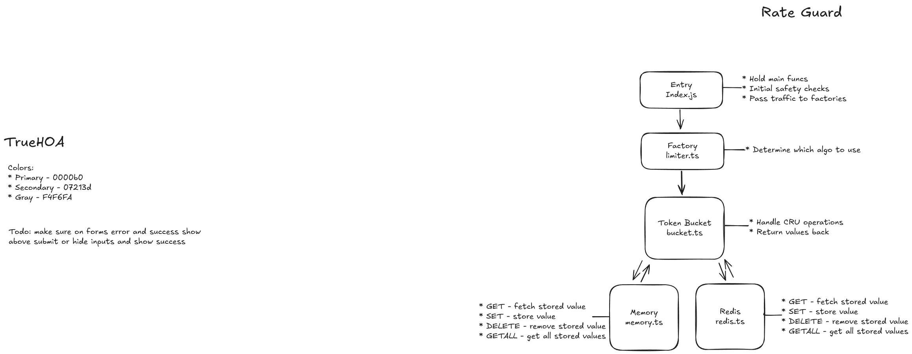

# Rate Limiter

A flexible, TypeScript-first rate limiting middleware for Express.js applications. Supports pluggable storage backends (memory, Redis), multiple rate limiting algorithms, and production-ready features like automatic cleanup and distributed scaling. Built with performance and developer experience in mind.
**badges - build status - coverage to go here**

## Table of Contents

## Quick Start

##### Installation
```npm install rate-limiter```

##### Basic Usage
```
import express from 'express';
import { createRateLimiter } from 'rate-limiter';

const app = express();

// Apply rate limiting: 100 requests per 15 minutes
const limiter = createRateLimiter({
  tokenLimit: 100,
  timeFrame: 15 * 60 * 1000
});

app.use(limiter);
app.get('/', (req, res) => res.send('Hello World!'));

app.listen(3000);
```
Your API is now protected with rate limiting. Test it by making requests to your protected endpoint - after 100 requests within 15 minutes, you'll get a 429 Too Many Requests response.

## Features

- Pluggable Storage - Memory store for development, Redis for production scaling
- TypeScript-First - Full type safety with JavaScript compatibility
- Token Bucket Algorithm - Industry-standard algorithm with burst tolerance
- Flexible Rate Keys - Rate limit by IP, user ID, API key, or custom identifiers
- Automatic Cleanup - Smart memory management with configurable intervals
- Multiple Limit Strategies - Global limits, per-endpoint limits, or mixed approaches
- Production Ready - Distributed-safe with Redis, handles race conditions
- Usage Statistics - Optional callback hooks for monitoring and dashboards
- Custom Handlers - Define custom responses when limits are exceeded
- Zero Dependencies - Lightweight core with optional Redis integration
- High Performance - Optimized for minimal latency and memory usage
- Multi-Instance Safe - Designed for horizontal scaling across servers

### What Sets It Apart

- Architecture-first design - Clean separation between algorithm, storage, and middleware layers
- True flexibility - Same middleware works for both global and per-route limiting without code changes
- Smart defaults - Works out of the box but extensively configurable for advanced use cases
- Developer experience - Comprehensive TypeScript support with intuitive API design

## Architecture Overview

### Core Components
```markdown
**Request Flow:**
1. **Middleware** (Express Layer) - Request interception and response handling
2. **Limiter** (Algorithm) - Token bucket calculations and decisions  
3. **Store** (Data Layer) - Persistent bucket state management

**Background Process:**
- **Cleanup** (Lifecycle) - Automatic memory management and optimization
```



### Component Responsibilities

##### Middleware Layer
Request interception and key extraction
Response handling and error formatting
Integration with Express.js ecosystem

##### Limiter (Algorithm)
Token bucket calculations and refill logic
Rate limit decision making (allow/deny)
Time-based token management

##### Store (Data Layer)
Persistent bucket state management
Pluggable backend support (Memory/Redis)
Atomic operations for concurrent safety

##### Cleanup (Lifecycle)
Automatic expired bucket removal
Memory optimization and leak prevention
Configurable cleanup intervals per store instance

### Key Design Decisions
##### Key-Agnostic Design
Rate limiter doesn't know about IPs, users, or routes
Accepts any string identifier for maximum flexibility
Enables global, per-route, or hybrid limiting strategies

##### Store Abstraction
Interface-based design allows storage backend swapping
Memory store for development, Redis for production
Custom stores can be implemented for specific needs

##### Lazy Evaluation
Token refill calculated on-demand rather than background timers
Reduces system overhead and improves accuracy
Eliminates timer drift issues

##### Single Responsibility
Each component has one clear purpose
Easy to test, debug, and extend
Clean upgrade path for new algorithms

## API Reference

Configuration options
Method signatures
Return values/types

## Advanced Usage

Multiple stores scenario
Custom key generation
Different limits per endpoint
Redis vs Memory considerations

## Algorithms

##### Token Bucket Algorithm
Models rate limiting as a bucket holding permission tokens. Each request consumes one token, and the bucket refills at a steady rate.

🪣 Bucket: 8/10 tokens

Request arrives → Check tokens → Allow/Deny → Refill over time
Core Logic:

Calculate tokens to add based on time elapsed
Cap at bucket capacity
Allow request if tokens ≥ 1, consume token
Deny if insufficient tokens

##### Why Token Bucket?
| Algorithm | Memory | Burst Handling | Accuracy | Complexity |
|-----------|--------|----------------|----------|------------|
| **Token Bucket** | ✅ Low | ✅ Excellent | ✅ High | ✅ Simple |
| Fixed Window | ✅ Low | ❌ Poor | ⚠️ Edge cases | ✅ Simple |
| Sliding Log | ❌ High | ✅ Perfect | ✅ Perfect | ❌ Complex |
| Sliding Counter | ✅ Low | ⚠️ Good | ⚠️ Approximated | ⚠️ Moderate |

**Key Benefits:**
- **Burst-friendly**: Users can "save up" tokens for legitimate spikes
- **Memory efficient**: Only 16 bytes per user vs 800+ for sliding log
- **O(1) operations**: Constant time performance
- **Industry standard**: Used by AWS, GitHub, Stripe

##### Performance
- **Memory store**: Extremely fast (in-process)
- **Redis store**: Network-bound but production-ready
- **Operations:** 2 Redis calls per request (GET + SET)
- **Cleanup:** <1% CPU overhead with hourly intervals

## Storage Backends
Memory store (dev/testing)
Redis store (production)
Custom store implementation guide

## Performance & Scaling

Benchmarks
Multi-instance considerations
Cleanup strategy

## Examples

Common patterns
Production scenarios
Integration examples

## Contributing

Development setup
Testing guidelines

## License
[MIT Licenese](./LICENSE)
